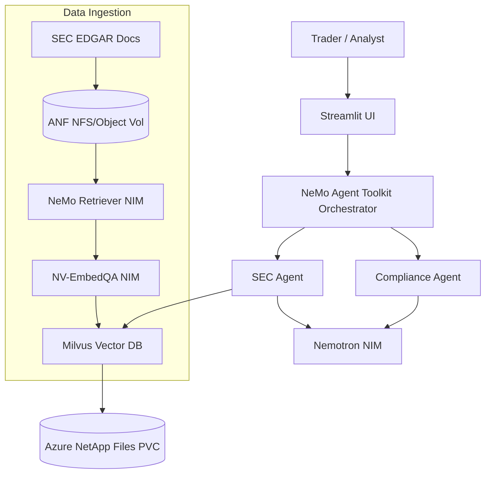

# Architecture: Agentic AI for Capital Markets

The AlphaAgent Copilot demonstrates the "Better Together" value proposition of **Microsoft Azure, NVIDIA AI, and Azure NetApp Files** for producing high-fidelity financial research.

Unlike prototyping environments, this architecture is a full 4-layer production deployment targeting **Azure Kubernetes Service (AKS)** running sovereign **NVIDIA NIM Microservices**.

---

## The 4-Layer Enterprise Stack

### 1. The Data Layer: Azure NetApp Files (ANF)

* **Challenge**: Capital markets firms have exabytes of unstructured data (SEC filings, research PDFs, transcripts) sitting on enterprise NAS. traditional AI requires ETL to object stores, duplicating data and breaking compliance.
* **Solution**: ANF provides file/object duality. Existing apps write PDFs via NFS. The AI pipeline (`ingest.py`) reads those exact same files using the native `boto3` library via the ANF Object REST API (S3-compatible). **Zero data movement.**

### 2. The AI Processing Layer: AKS + NVIDIA NIM

* **Compute**: AKS GPU Node Pools (`Standard_ND96isr_H100_v5` or `Standard_NC24ads_A100_v4`).
* **Infrastructure Management**: NVIDIA GPU Operator ensures automated driver and container runtime provisioning.
* **Accelerated Microservices (NIMs)**:
  * **NeMo Retriever**: Multimodal extraction. Parses complex financial tables and charts from SEC PDFs.
  * **NV-EmbedQA-E5-v5**: Generates high-quality vector embeddings.
  * **NV-RerankQA**: Precision semantic scoring for RAG.
  * **Nemotron Super 49B / Nano**: Local LLM reasoning engine ensuring data never leaves the cluster.

### 3. The Intelligence Layer: NeMo Agent Toolkit

* **Orchestration**: `nvidia-nat` drives a 6-agent collaborative workflow defined in declarative YAML.
    1. *Orchestrator*: Decomposes questions and routes work.
    2. *SEC Agent*: Interrogates Milvus vectors for fundamental data.
    3. *Earnings Agent*: Analyzes transcript sentiment.
    4. *News Agent*: Ingests real-time events.
    5. *Compliance Agent*: Validates outputs against SEC/FINRA guardrails.
    6. *Summarization Agent*: Synthesizes the final markdown brief.
* **Vector DB**: **Milvus** StatefulSet on AKS, backed by ANF NFS PVC for persistence, accelerated by NVIDIA cuVS.

### 4. The Interface Layer: Copilot UI

* **App**: Streamlit web application.
* **Observability**: Real-time agent traces and token usage profiling powered by NeMo Agent Toolkit telemetry.

---

## Data Flow Diagram

## Security & Sovereignty

* All inference occurs locally within the AKS cluster.
* No corporate data is sent to external APIs like OpenAI or Anthropic.
* Azure NetApp Files provides encryption-at-rest, ransomware protection, and instantaneous snapshots for regulatory compliance.
